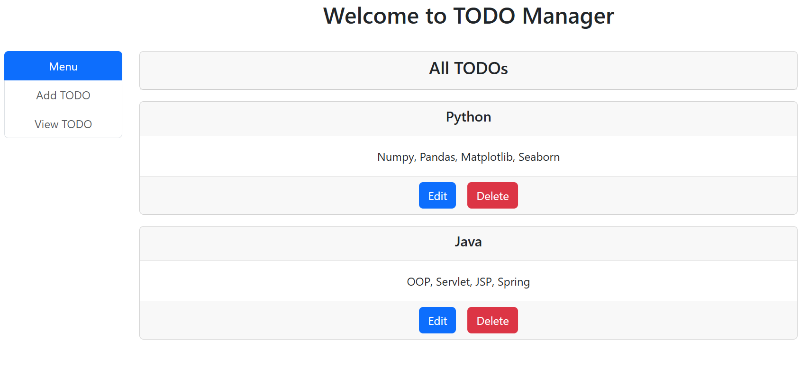
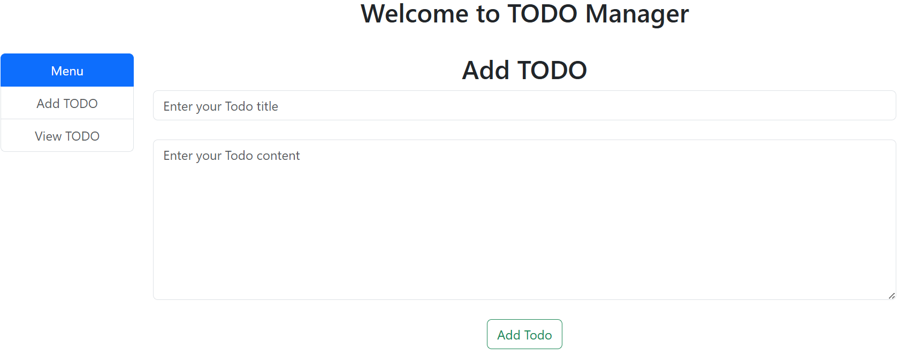
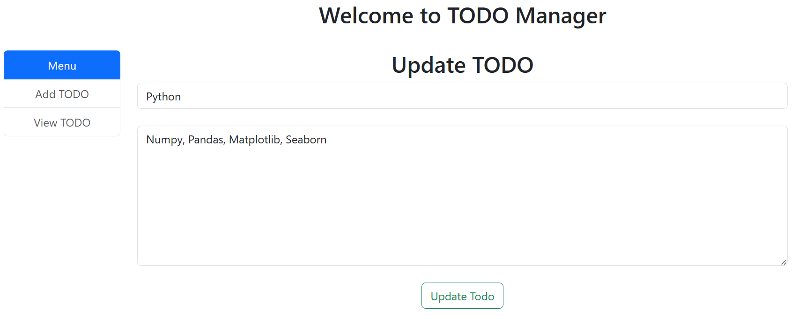
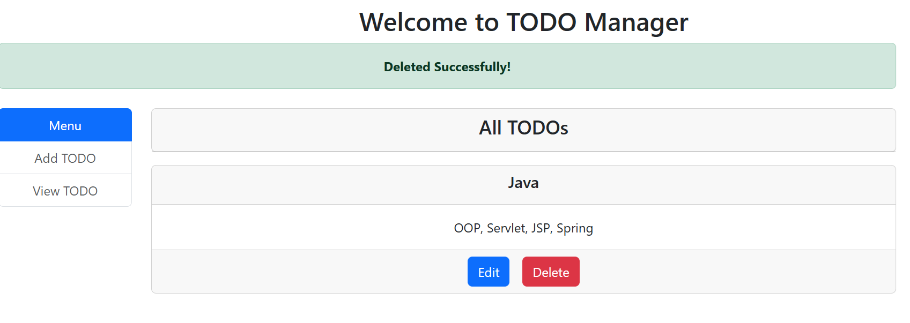

# todo-app
A Spring MVC + JSP ToDo Manager application implementing full CRUD operations (Create, Read, Update, Delete) using Java, JSP, Servlets, Spring MVC, Hibernate, MySQL, and Bootstrap.

## Features
- Add, Edit, Delete, View TODOs
- Fully functional CRUD
- Responsive UI using Bootstrap

## Tools & Technologies
- Java, JSP, Servlets
- Spring MVC
- Hibernate (ORM)
- MySQL
- Bootstrap
- Maven

## Setup Instructions
1. Configure MySQL database.
2. Run the project on Apache Tomcat server from Eclipse.
3. Access in browser: `http://localhost:9090/ToDoApp/home`

## Screenshots

